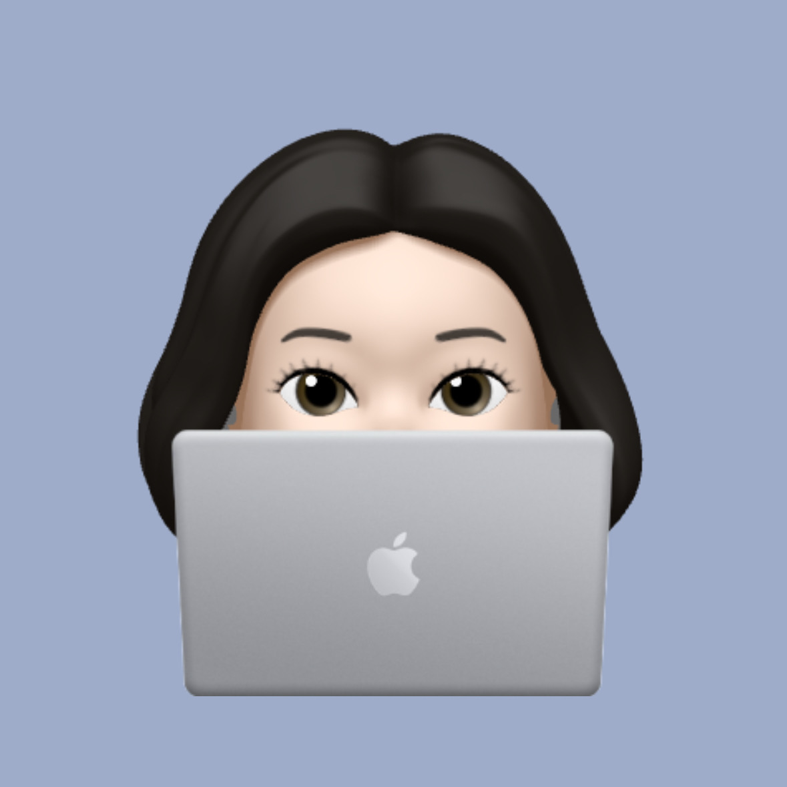

## 🙋🏻‍♀️ Hi there ❗

<samp>I'm Chaeyoung Lee from 🇰🇷 Republic of Korea. You can call me **Chaeyoung** !!  
I majored in software studies at Korea National University of Transportaion.👩🏻‍🎓 
I'm studying hard to be a **Full Stack Developer**.✏️ And I like to challenge myself!🎶  

***Recent Challenges***  
Swim 🏊🏻‍♀️ , Video Editing 📽️ and Design 💻

### Who am I ?
- Graduated from Korea National University of Transportaion.🎓
- My personality type is **ENTJ**, the bold leader.
- 
- 
- Big Fan of Baseball ⚾

 
<h2>👩🏻‍💻 Skills </h1>
<h3>🧩 Platforms & Languages</h3>

  

  

   

  
  

<h3>🛠️ Tools</h3>

  

   

  
  
   
  

  

